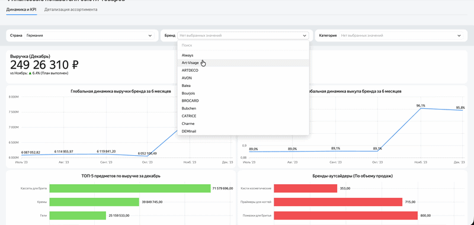

# Анализ эффективности ассортиментной матрицы бьюти-товаров и контроль KPI выкупа
Datalens + Pandas

## 📌 Описание проекта
Коммерческий проект по разработке аналитической системы для бьюти-ритейлера, направленный на оптимизацию товарной матрицы и аудит контрактов с косметическими брендами. Проект решает задачу объединения разнородных финансовых и транзакционных данных для выявления низкомаржинальных товаров и контроля ключевых операционных показателей цепочки продаж.

**🎯 Главный бизнес-результат:** Инструмент успешно внедрен в регулярные бизнес-процессы компании (используется на стратегических созвонах с CEO). Позволил руководству оперативно принимать решения о выводе непопулярных SKU с низким спросом из матрицы и точечно запускать маркетинговые акции для дорогих товаров с низким выкупом, поддерживая плановый рост выручки на **5%**.

---

## 🛠️ Технологический стек
* **Языки и библиотеки:** `Python`, `Pandas`, `NumPy`
* **Базы данных & Хранилища:** `SQL`, `MS Excel` (работа с историческими выгрузками)
* **Визуализация (BI):** `Datalens` (интерактивная отчетность и факторный анализ)

---

## 📐 Архитектура данных и этапы реализации

### 1. Объединение данных (Data Blending) & ETL
* Реализован сбор и трансформация данных из двух изолированных источников:
  1. *Транзакционная таблица по товарам:* текущие розничные цены, фактическая выручка, маржинальность и оборачиваемость.
  2. *Историческая выгрузка финансовых метрик:* агрегированные показатели брендов в динамике по месяцам.
* С помощью Python (Pandas) написан конвейер очистки данных для нормализации названий категорий, подкатегорий и стран происхождения бьюти-товаров.

### 2. Расчет операционных KPI ритейла
На базе объединенных массивов данных были рассчитаны ключевые метрики эффективности:
* **Выручка MoM (Month-on-Month):** оценка динамики роста продаж месяц к месяцу.
* **Объем продаж в штуках** и расчет **средней цены товара (AOV)** по категориям.
* **Процент выкупа:** важнейший KPI ритейла, отражающий долю реально выкупленного товара клиентами (целевой ориентир бизнеса — **95%**).

### 3. Проектирование системы фильтрации и факторного анализа
* Спроектирована гибкая система срезов по брендам, ценовым сегментам и странам-производителям, позволяющая топ-менеджменту точечно находить "дорогие товары с низким выкупом", и определять причины просадки маржи.

### 4. Визуализация в Datalens
Разработан интерактивный дашборд для руководства, включающий:
* Карточки текущих KPI с индикацией отклонений от плана.
* Матричную диаграмму распределения брендов по объему продаж и маржинальности.
* Тренд-лайны для отслеживания динамики выкупа в разрезе товарных линеек.

---

## 📊 Демонстрация работы дашборда

<!-- Наша загруженная бьюти-гифка мгновенно отобразится здесь -->

---

## 📂 Структура репозитория
* `notebooks/` — Jupyter Notebooks с кодом очистки, трансформации и объединения таблиц на Pandas.
* `sql/` — SQL-скрипты для агрегации транзакционных метрик.
* `dashboards/` — файл книги Tableau (если применимо) или ссылка на веб-версию отчета.
